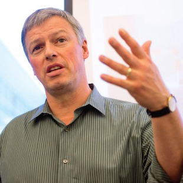

:wave: Welcome to the **1st Workshop and Challenge on
Computer Vision In The Built Environment For The Design, Construction and Operation of Buildings** organized at :wave:  
{: .text-center} 

The workshop will connect the domains of Architecture, Engineering and Construction (AEC) with that of Computer Vision by establishing a common ground of interaction and identify shared research interests. These topics will be presented from the dual lens of Computer Vision and AEC, highlighting the limitations and bottlenecks related to developing applications for this specific domain. The objective is for the two communities to come together and solve problems that are relevant in the AEC community, such as understanding the construction sites as it is changing, as well as automatically generating building models from scans of real data.

This workshop will also host the **2nd International Scan-to-BIM competition** challenge focused on key problems when converting 3D point cloud data obtained using lidar, photogrammetry, or depth map cameras to Building Information Models (BIMs). BIMs represent different elements of a building in a semantically rich manner, identifying objects, associated attributes, and geometrical and topological relationships. AEC firms and public agencies create BIMs to design new buildings and other structures; however, BIMs are rarely available for existing buildings or facilities. For maintenance, retrofitting, or renovation AEC entities could greatly benefit from access to BIMs of their facilities, because interpreting 2D as-built drawings is very time consuming and leads to many errors and omissions. Furthermore, asset owners could use BIMs for operations and maintenance as BIMs enable storing and having access to attributes such as maintenance history, material type, manufacturer specifications among others.

However, current computer vision evaluations are mainly done on familiar evaluation metrics such as Intersection-over-Union (IoU) or classification accuracy, rather than metrics that are more relevant in practice in the AEC community, such as geometrical and topological connections between different spaces and openings. This challenge aims to bring the computer vision, civil engineering, geomatics, and construction communities together by creating new tasks and evaluation metrics that can be tackled by computer vision researchers while being of interest to and fulfilling the objectives of the AEC community.

The workshop will therefore consist of two parts: invited <a href="#speakers" target="_self">keynote talks</a> and a  <a href="#challenge" target="_self">Scan-to-BIM challenge</a>.

---

## :hourglass_flowing_sand: **Important Dates** {#dates}
> **NOTE**: The submission/release times are **00:00:00 UTC** on the specified date.
 
- **12 May 2021 ---** Release of validation and testing sets
- **11 Jun 2021 (11:59PM PDT) ---** Challenge submission deadline
- **15 Jun 2021 ---** Notification to participants
- **20 Jun 2021 ---** CV4AEC Workshop @ CVPR 2022

---

## :calendar: **Schedule** {#schedule}
The workshop took place on **20 June 2021** from **13:00 - 17:30**. The recording can be found [here](https://www.youtube.com/playlist?list=PL7UDzHq49jadLYFq6lHgEessmrjfKXsDw).

> **NOTE**: Times are shown in **Central Daylight Time**. Please take this into account if joining the workshop virtually.

| Time (PDT)    | Duration | Event                                                                  |
|---------------|----------|------------------------------------------------------------------------|
| 13:00 - 13:30 | 30 mins  | Introduction To The Workshop & Challenge                              |
| 13:30 - 14:00 | 30 mins  | **Derek Hoeim** -- Vision for Construction in Practice: Lessons from Startup Experience |
| 14:00 - 14:30 | 30 mins  | Winner Presentations, 2D Floorplan Reconstruction  |
| 14:30 - 15:00 | 30 mins  | **Prof. Eleni Papadonikolaki** -- Digitalisation beyond BIM: Towards a data-driven future of the Architecture, Engineering and Construction (AEC) |
| 15:00 - 15:15 | 15 mins  | _Coffee Break_                                                         |
| 15:15 - 15:45 | 30 mins  | Winner Presentations, 3D Building Model Reconstruction                                         | 
| 15:45 - 16:15 | 30 mins  | **Yasutaka Furukawa** -- HouseGAN: Teaching Computers to Design Architecture                        |
| 16:15 - 16:45 | 30 mins  | **Frédéric Bosché** -- Scan-to-BIM for Energy Efficiency Renovation of Buildings                 |
| 16:45 - 17:15 | 30 mins  | _Panel Discussion_ -- Moderator:  Marzia Bolpagni |
| 17:15 - 17:30 | 15 mins  | _Concluding Remarks_                                                   |

---

## :microphone: **Keynote Speakers** {#speakers}

<figure>
    
    <b> <a href="https://www.macegroup.com/people/experienced-people/marzia-bolpagni">Marzia Bolpagni</a>
     Head of BIM International at Mace   Honorary Lecturer at UCL</b>
</figure>

<figure>
    
    <b> <a href="https://www.eng.ed.ac.uk/about/people/dr-frederic-bosche">Frédéric Bosché</a>
     Professor, CEE  University of Edinburgh</b>
</figure>

<figure>
    
    <b> <a href="https://yasu-furukawa.github.io/">Yasutaka Furukawa</a>
     Professor, CS  SFU</b>
</figure>

<figure>
    
    <b> <a href="https://dhoiem.cs.illinois.edu/">Derek Hoiem</a>
     Professor, CS  UIUC</b>
</figure>

<figure>
    
    <b> <a href="https://www.ucl.ac.uk/bartlett/construction/people/dr-eleni-papadonikolaki">Eleni Papadonikolaki</a>
     Professor, The Bartlett School of Sustainable Construction   UCL</b>
</figure>

[**Marzia Bolpagni**](https://www.macegroup.com/people/experienced-people/marzia-bolpagni)
works as Head of BIM International at Mace where she develops and implements digital construction solutions for public and private international clients in five international hubs. She holds a PhD in ICT and Smart Construction and she is passionate in filling the gap between industry and academia. She is glad to be a member of the BIMExcellence Initiative, Assistant Editor of the BIM Dictionary where she coordinates more than 120 volunteers worldwide, Ambassador of the UK BIMAlliance and Expert at the European Committee for Standardisation (CEN) TC 442 where she chairs a Task Group on information requirements standardisation (Level of Information Need). She is lead author of the Level of Information Need standard EN 17412-1, Chair of EC3 Modelling and Standards Committee and Honorary Lecturer at UCL The Bartlett School of Sustainable Construction. She is also founder of Italians in Digital Transformation UK, she loves sharing her knowledge with students and she is often invited as keynote speaker at academic and industrial events. She received several awards for her activities including ‘Woman Ingenious’ in 2017 and Star Award for Innovation and Service Excellence by Mace in 2019.

[**Frédéric Bosché**](https://www.eng.ed.ac.uk/about/people/dr-frederic-bosche)
Frédéric Bosché is a Senior Lecturer in Construction Informatics at the University of Edinburgh. Within the University, he is a member of the School of Engineering, the Centre for Future Infrastructure (CFI) and the Edinburgh Centre for Robotics. Within that network, Frédéric leads the CyberBuild Lab whose research covers the areas of data processing, information management and information visualisation, all within the context of digital construction, project management and asset monitoring. Frédéric is the Programme Director of the MSc Leading Major Programmes, the current President of the International Association for Automation and Robotics in Construction (IAARC), and Associate Editor of the international journal of Automation in Construction. He has received several awards, including the IAARC Tucker-Hasegawa Award in 2018 for “distinguished contributions to the field of automation and robotics in construction”. Two of his main on-going research projects are the H2020-funded BIMERR and COGITO projects.

[**Yasutaka Furukawa**](https://engineering.purdue.edu/ME/People/ptProfile?resource_id=57291)
is an Associate Professor in the School of Computing Science at Simon Fraser University (SFU). Prior to joining SFU in 2017, he was an assistant professor at Washington University in St. Louis USA, and a software engineer at Google. He completed his Ph.D. at Computer Science Department of the University of Illinois at Urbana-Champaign in 2008. Dr. Furukawa received the best student paper award at ECCV 2012, the NSF CAREER Award in 2015, CS-CAN Outstanding Young CS Researcher Award 2018, Google Faculty Research Awards in 2016, 2017, and 2018, and PAMI Longuet-Higgins prize in 2020.

[**Derek Hoiem**]("https://engineering.nyu.edu/faculty/chen-feng") 
is an Associate Professor in Computer Science at the University of Illinois at Urbana-Champaign, since January 2009. Derek earned his PhD in Robotics from Carnegie Mellon University in 2007 and completed a postdoctoral fellowship at the Beckman Institute in 2008. Awards include ACM Doctoral Dissertation Award honorable mention, CVPR best paper award, Intel Early Career Faculty award, Sloan Fellowship, and PAMI Significant Young Researcher award. Derek Hoiem is also co-founder and leads the vision team at Reconstruct, a construction technology company that integrates image 3D processing and analysis with plans and schedule to compare as-built to as-planned.

[**Eleni Papadonikolaki**](https://www.cs.princeton.edu/~funk/) 
ARB, MAPM, SFHEA, is an Associate Professor in Digital Innovation and Management at University College London (UCL) Bartlett School of Sustainable Construction (BSSC) and a management consultant with Digital Outlook. She has a PhD in Design and Construction Management from TU Delft, Netherlands. Bringing practical experience of working as an architect engineer and design manager on a number of complex and international projects in Europe and the Middle East, she is researching and helping teams manage the interfaces between digital technology and their work. Eleni is the author of over 60 peer reviewed publications, for instance in the International Journal of Project Management, Construction Management and Economics and others. She has attracted and delivered collaborative research projects of total worth circa £10M as Principal and Co-Investigator funded by European and UK research councils. She is the Director of the MSc Digital Engineering Management at UCL where she develops the new generation of leaders in digital transformation.

## :checkered_flag: **Challenge** {#challenge}
The workshop will host the 4th International Scan-to-BIM challenge. The challenge will include the following tasks:

I. 2D Floorplan Reconstruction \
II. 3D Building Model Reconstruction

**[[GitHub](https://github.com/GradientSpaces/cv4aec-challenge)]**
{: .text-center}

The dataset is available via email. You will need a registered account to download the dataset. Once you submit a request for registration, it will be inspected and a registration link will be sent to you within 24 hours. The challenge contains a total of 31 buildings with multiple floors each and dozens of rooms on each floor. Of which, 20 buildings are designated as the training set, with a total of 49 point clouds. The validation and testing sets contain 5.5 buildings with 21 point clouds each. For each model, there is a point cloud in LAZ format. For the training and validation sets, a corresponding floorplan aligned with the coordinate system of the point cloud is also provided.

### 2D Floor Plan Reconstruction

Tthe training set consists of the point clouds of 20 buildings with multiple floors each, with a total of 49 point clouds, as well as corresponding 2D building models for each floor with multiple extracted layers. These layers include: walls, curved walls, doors, windows, stairs, and columns. The buildings have complicated floor structures which could include dozens of rooms, curved walls and many doors on each floor. We have released 6 new buildings as the validation set and another 6 as the testing set. The validation set contains point clouds and their corresponding 2D building models. For the testing set, only the point clouds will be made available, while the 2D building models will not be made available and we will host a server to evaluate the submissions. We include metrics to evaluate the reconstruction of the walls, doors, and columns, as well as floor area in 2D : 

1. **Geometric Metrics** \
    a. _IoU_ of each room (a room is defined as a completely separated area with walls and doors). \
    b. _Accuracy of endpoints_ : Precision/Recall at 3 different thresholds: 5cm, 10cm and 20cm, as well as the F-measure at each threshold will be evaluated in the coordinate system of the point cloud. The provided endpoints will be matched with the Hungarian algorithm to the point cloud, and every point that is within a certain threshold will be determined as a match. \
    c. _Orientation_ For each matched line between the ground truth, we will compute the cosine similarity metric between them as the normalized dot product. If a line is not matched with ground truth, the cosine metric will be zero. Finally, the metric will be averaged over all the ground truth lines.

2. **Topological Metrics** \
    a. _[Warping error](https://ieeexplore.ieee.org/document/5539950)_ : The warping error will first warp the predicted floorplan to the ground truth with a homotopic deformation, and then compute the pixels that cannot match after the deformation. \
    b. **_Betti number error_** : The Betti number error will compare the Betti numbers between the prediction and the ground truth and output the absolute value of the difference.

### 3D Building Model Reconstruction

The training set consists of point clouds of 4 buildings with multiple floors, as well as the corresponding 3D building model in AutoCAD DXF format. We aim to release 2 more buildings for the validation set and 2 more as the testing set. For 3D, because of the difficulty to come up with correct ground truth and have a consistent file format that is acceptable to both the computer vision and AEC communities, we have decided that we will use an expert panel to evaluate the submissions manually. We will aim to have automatic evaluations for the challenges in next years.

> In our JSON format, we provide walls as middle lines + thickness. The middle lines will connect to each other at corners. Hence there is no ambiguity on which part of the corner belongs to which wall.
> We would like to note that ALL the submissions **need to be constructed automatically**. Manual reconstructions are against the spirit of this challenge and will not be allowed.

---

## :trophy: **Challenge Winners** {#winners}

### 2D Floor Plan Reconstruction

| Team        |   Precision (2cm) |   Precision (5cm) |   Precision (10cm) |   Recall(2cm) |   Recall(5cm) |   Recall (10cm) |   IoU |   Warping Error |   Betting Error |
|-------------|-------------------|-------------------|--------------------|---------------|---------------|-----------------|-------|-----------------|-----------------|
| VecISR-2D   |             0.057 |             0.234 |              0.385 |         0.021 |         0.085 |           0.136 | 0.569 |           0.256 |           1.186 |
| GTS2B       |             0.022 |             0.097 |              0.191 |         0.009 |         0.004 |           0.082 | 0.347 |           0.232 |           1.132 |
| FloorPP-Net |             0.011 |             0.042 |              0.065 |         0.071 |         0.256 |           0.386 | 0.119 |           0.268 |           1.204 |
| PointWeaver |             0.002 |             0.009 |              0.021 |         0.006 |         0.031 |           0.069 | 0.115 |           0.336 |           1.915 |
| Yusuf_Sahin |             0.003 |             0.001 |              0.002 |         0.039 |         0.096 |           0.156 | 0.084 |           0.268 |           1.764 |

### 3D Building Model Reconstruction

| Team                                                                                              |   Accuracy |   Completeness |   Correctness |   Bonus |   Total Score |
|---------------------------------------------------------------------------------------------------|------------|----------------|---------------|---------|---------------|
| Superpoint Graphs                                                                                 |        688 |            643 |           695 |     330 |          2356 |
| PointWeaver                                                                                       |        688 |            643 |           695 |     330 |          2356 |
| VecISR-3D                                                                                         |        700 |            629 |           680 |     213 |          2222 |
| GTS2B                                                                                             |        624 |            593 |           565 |     331 |          2112 |

### **Teams**
 * **VecISR-2D**: Jiali Han, Shuhan Shen; Institute of Automation, Chinese Academy of Sciences
 * **GTS2B**: Jingdao Chen, Jisoo Park, Yosuke Yajima, Seongyong Kim; Georgia Institute of Technology
 * **FloorPP-Net**: Yijie Wu, Fan Xue; Hong Kong University
 * **PointWeaver**: Fiona Collins, Saeed Mafipour, Florian Noichl, Yuandong Pan, Miguel Vega; Technical University of Munich
 * **Yusuf_Sahin**: Yusuf Sahin; Istanbul Technical University
 * **Superpoint Graphs**: Liu Yang, Yi-Chun Lin, Ayman Habib, Hubo Cai; Purdue University

---

## :question: **Questions** {#questions}
Contact the organisers at **[cv4aec.3d@gmail.com](mailto:cv4aec.3d@gmail.com)**

---
# **Organizers** {#organizers}
## :construction_worker: **Organizers**

<figure>
    
    <b> <a href="https://ir0.github.io/">Iro Armeni</a>
     Postdoctoral Researcher, CS & CEE    ETHZ</b>
</figure>

<figure>
    
    <b> <a href="https://www.linkedin.com/in/erzhuo-ezra-che-40888137/">Erzhuo Che</a>
     Assistant Professor, CEE   Oregon State</b>
</figure>

<figure>
    
    <b> <a href="https://ce.gatech.edu/directory/person/yong-kwon-cho">Yong Cho</a>
     Associate Professor, CEE   GaTech</b>
</figure>

<figure>
    
    <b> <a href="https://web.stanford.edu/~fischer/">Martin Fischer</a>
     Professor, CEE   Stanford</b>
</figure>

<figure>
    
    <b> <a href="https://fcl.ethz.ch/people/Module-Lead/daniel-hall.html#:~:text=Dr%20Daniel%20Hall%20is%20co,Geomatic%20Engineering%20at%20ETH%20Z%C3%BCrich.">Daniel Hall</a>
     Assistant Professor, CEE   ETHZ</b>
</figure>

<figure>
    
    <b> <a href="https://research.engr.oregonstate.edu/geomatics/faculty-members">Jaehoon Jung</a>
     Assistant Professor, CEE   Oregon State</b>
</figure>

<figure>
    
    <b> <a href="http://web.engr.oregonstate.edu/~lif/">Fuxin Li</a>
     Associate Professor, CS   Oregon State</b>
</figure>

<figure>
    
    <b> <a href="https://directory.forestry.oregonstate.edu/people/olsen-michael">Michael Olsen</a>
     Associate Professor, CEE   Oregon State</b>
</figure>

<figure>
    
    <b> <a href="https://people.inf.ethz.ch/pomarc/">Marc Pollefeys</a>
     Professor, CS   ETHZ</b>
</figure>

<figure>
    
    <b> <a href="https://profiles.stanford.edu/silvio-savarese">Silvio Savarese</a>
     Professor, CS   Stanford</b>
</figure>

<figure>
    
    <b> <a href="https://cce.oregonstate.edu/turkan">Yelda Turkan</a>
     Assistant Professor, CEE   Oregon State</b>
</figure>

