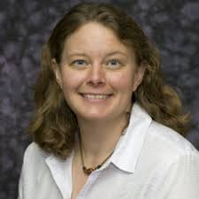
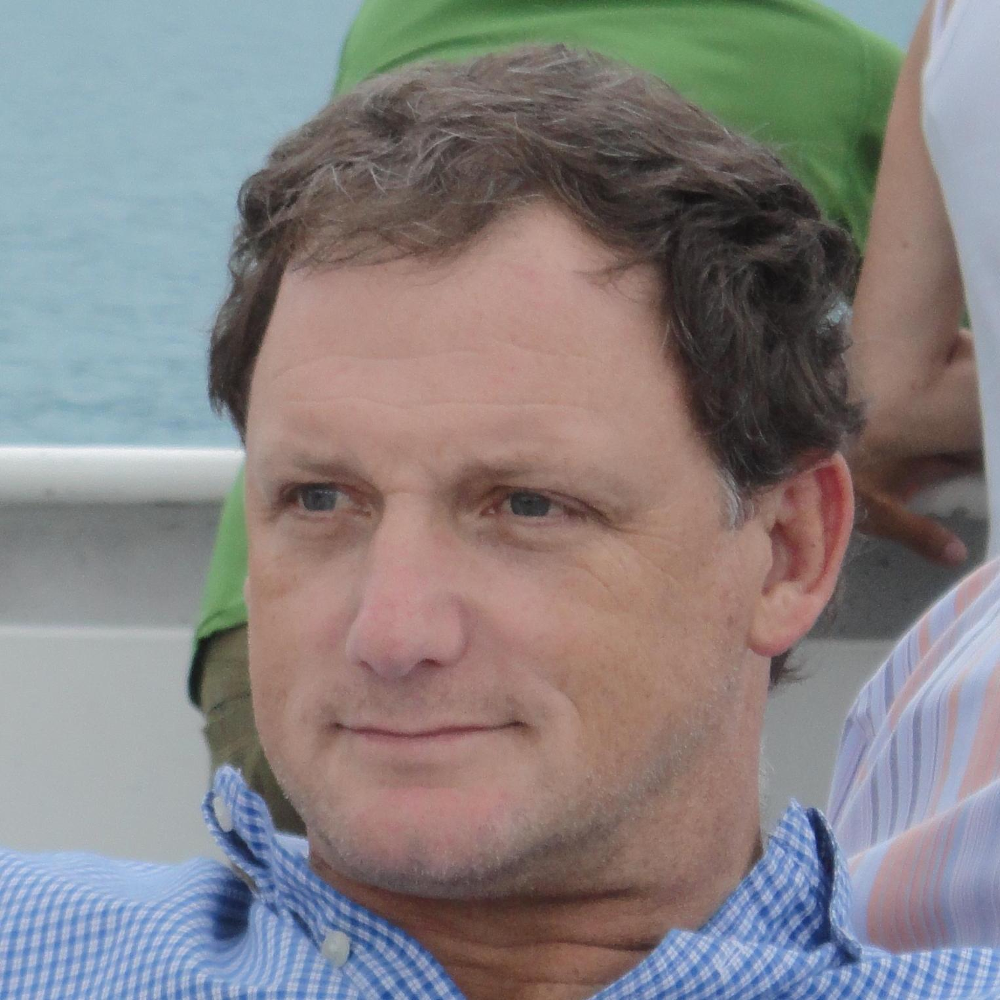
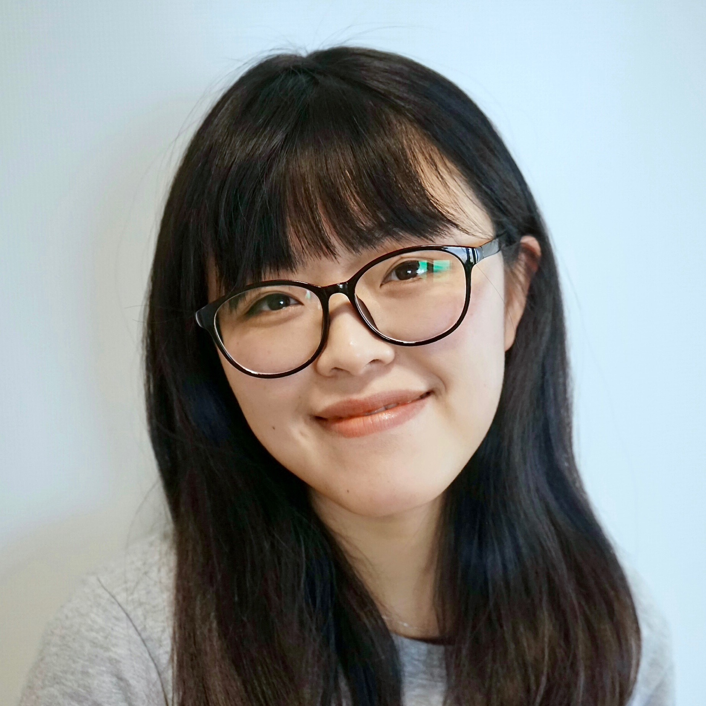
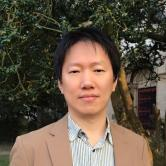
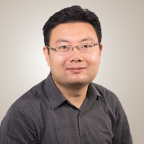

:wave: Welcome to the **2nd Workshop and Challenge on
Computer Vision In The Built Environment For The Design, Construction and Operation of Buildings** organized at :wave:  
{: .text-center} 

Building on the success of the 1st workshop, the 2nd Workshop on Computer Vision in the Built Environment continous on connecting the domains of Architecture, Engineering, and Construction (AEC) with that of Computer Vision by establishing a common ground of interaction and identify shared research interests. . Specifically, this workshop focuses on the as-is semantic status of built environments and the changes that take place within them over time. These topics will be presented from the dual lens of Computer Vision and AEC-FM, highlighting the limitations and bottlenecks related to developing applications for this specific domain. The objective is for attendees to learn more about AEC-FM and the variety of real-world problems that, if solved, could have a tangible impact on this multi trillion dollar industry as well as the overall quality of life across the globe.

The workshop will begin by establishing ways to acquire the as-is status of a space in a granular and hierarchical way - some of the speakers are experts in acquiring the spatial layout whereas others focus on object categories and their attributes. Building on this static scene understanding, we introduce the impact of time, as change that is either explicitly observed (a human interacting with an object) or implicitly inferred (capturing the as-is status of a scene in different timestamps). The combination of the static and dynamic understanding of 3D scenes is at the core of AEC-FM industry and currently missing. One example is that architects typically design living spaces without any feedback from their previous designs. Another example is that 5-12% (this percentage corresponds annually to billions of dollars in the US alone) of non-estimated construction cost is due to rework that originates from misinterpretation of design documents and the dynamically changing environment of construction sites.

To further establish connections between the two domains and identify what we can do right now and what is still hard to solve, we will host the **2nd International Scan-to-BIM competition** targeted on acquiring the semantic as-is status of buildings given their 3D point clouds. Specifically, we will focus on the tasks of floorplan reconstruction and 3D building model reconstruction and present appropriate interdisciplinary metrics for solving them. Last year we observed that a large gap remains before these problems can be considered solved and actually meet the needs of practitioners. We regard this workshop as the ideal environment for understanding the challenges and steps forward given that it provides convergence between the research and practical communities from multiple disciplines.

The workshop will therefore consist of two parts: invited <a href="#speakers" target="_self">keynote talks</a> and a  <a href="#challenge" target="_self">Scan-to-BIM challenge</a>.
---

## :hourglass_flowing_sand: **Important Dates** {#dates}
> **NOTE**: The submission/release times are **00:00:00 UTC** on the specified date.
 
- **01 May 2022 ---** Evaluation server open to evaluate test submissions
- **12 Jun 2022 (11:59PM PDT) ---** Challenge submission deadline
- **15 Jun 2022 ---** Notification to participants
- **19 Jun 2022 ---** CV4AEC Workshop @ CVPR 2022

---

## :calendar: **Schedule** {#schedule}
The workshop took place on **19 June 2022** from **09:00 - 17:00 PDT**.

> **NOTE**: Times are shown in **Central Standard Time**. Please take this into account if joining the workshop virtually.

| Time (PDT)    | Duration | Event                                                                  |
|---------------|----------|------------------------------------------------------------------------|
| 09:00 - 09:30 | 30 mins  | Introduction To The Workshop & Challenge                               |
| 09:30 - 10:00 | 30 mins  | **Burcu Akinci** -- Lessons learned from decades of research in utilizing computer vision to support construction and infrastructure management |
| 10:00 - 10:30 | 30 mins  | **Angela Dai** -- Learning from Synthetic 3D Priors for Real-World 3D Perception |
| 10:30 - 11:15 | 30 mins  | Winner Presentations, 2D Floorplan Reconstruction  |
| 11:15 - 11:30 | 15 mins  | _Coffee Break_                                                         |
| 11:30 - 12:00 | 30 mins  | **Shirley Dyke** -- Applying Machine Learning to Support Disaster Reconnaissance |
| 12:00 - 12:30 | 30 mins  | **Siyu Tang**                                                     |
| 12:30 - 13:15 | 45 mins  | Winner Presentations, 3D Building Model Reconstruction                                         | 
| 13:15 - 14:15 | 60 mins  | _Lunch Break_                         |
| 14:45 - 15:00 | 45 mins  | Community Engagement                  |
| 15:00 - 15:30 | 30 mins  | **Chen Fueng** -- Weakly and Self Supervised Robot Perception: from Scene Understanding to Mobile Construction in AEC |
| 15:30 - 16:00 | 30 mins  | **Thomas Funkhouser** -- Neural Scene Representations in Urban Environments  |
| 16:00 - 16:30 | 30 mins  | **Federico Tombari** -- 3D scene understanding with scene graphs and self-supervision for AR and indoor design |
| 16:30 - 17:00 | 30 mins  | _Coffee Break_                                                   |
| 17:00 - 17:45 | 45 mins  | _Panel Discussion_ |
| 17:45 - 18:00 | 15 mins  | _Concluding Remarks_                                                   |

---

## :microphone: **Keynote Speakers** {#speakers}

<figure>
    
    <b> <a href="https://www.cmu.edu/cee/people/faculty/akinci.html">Burcu Akinci</a>
     Professor, CEE  CMU</b>
</figure>

<figure>
    
    <b> <a href="https://www.3dunderstanding.org/team.html">Angela Dai</a>
     Professor, CS  TU MUnich</b>
</figure>

<figure>
    
    <b> <a href="https://engineering.purdue.edu/ME/People/ptProfile?resource_id=57291">Shirley J. Dyke</a>
     Professor, ME & CEE  Purdue</b>
</figure>

<figure>
    
    <b> <a href="https://engineering.nyu.edu/faculty/chen-feng">Chen Feng</a>
     Professor, ME & CEE  NYU</b>
</figure>

<figure>
    
    <b> <a href="https://www.cs.princeton.edu/~funk/">Thomas Funkhouser</a>
     Senior Research Scientist Google</b>
</figure>

<figure>
    
    <b> <a href="https://vlg.inf.ethz.ch/team/Prof-Dr-Siyu-Tang.html">Siyu Tang</a>
     Professor, CS  ETHZ</b>
</figure>

<figure>
    
    <b> <a href="https://federicotombari.github.io/">Federico Tombari</a>
     Senior Staff Research Scientist and Manager Google</b>
</figure>

[**Burcu Akinci**](https://www.cmu.edu/cee/people/faculty/akinci.html)
is Paul Christiano Professor of Civil & Environmental Engineering at Carnegie Mellon University and a member of the National Academies of Construction. She was also former Associate Dean for Research for the College of Engineering and Director of Engineering Research Accelerator at Carnegie Mellon. She earned a bachelor’s degree in civil engineering from the Middle East Technical University (Ankara, Turkey), MBA from Bilkent University (Ankara, Turkey), and Master’s and PhD degrees in Civil and Environmental Engineering with a specialization in Construction Engineering and Management from Stanford University. Dr. Akinci’s research focuses on investigating utilization and integration of building information models with data capture technologies, such as 3D imaging and embedded sensors, to create digital twins of construction projects and infrastructure operations, and develop approaches to support proactive and predictive operations and management.

[**Angela Dai**](https://www.3dunderstanding.org/team.html)
is an Assistant Professor at the Technical University of Munich. Her research focuses on understanding how the 3D world around us can be modeled and semantically understood, leveraging generative deep learning towards enabling understanding and interaction with real-world 3D/4D scenes for content creation and virtual or robotic agents. Previously, she received her PhD in computer science from Stanford in 2018 and her BSE in computer science from Princeton in 2013. Her research has been recognized through a ZDB Junior Research Group Award, an ACM SIGGRAPH Outstanding Doctoral Dissertation Honorable Mention, as well as a Stanford Graduate Fellowship.

[**Shirley J. Dyke**](https://engineering.purdue.edu/ME/People/ptProfile?resource_id=57291)
holds a joint appointment in Mechanical Engineering and Civil Engineering at Purdue University. She is the Director of Purdue's Intelligent Infrastructure Systems Lab and the Director of the NASA funded Resilient ExtraTerrestrial Habitat Institute. Dyke is the Editor-in-Chief of the journal Engineering Structures. Her research focuses on “intelligent” structures, and her innovations encompass structural health monitoring and machine learning for structural damage assessment and reconnaissance support. She holds a B.S. in Aeronautical and Astronautical Engineering from the University of Illinois, Champaign-Urbana in 1991 and a Ph.D. in Civil Engineering from the University of Notre Dame in 1996. She was awarded the Presidential Early Career Award for Scientists and Engineers from NSF (1998), the International Association on Structural Safety and Reliability Junior Research Award (2001) and the ANCRiSST Young Investigator Award (2006).

[**Chen Feng**]("https://engineering.nyu.edu/faculty/chen-feng") 
is an assistant professor at NYU, appointed across departments including civil and mechanical engineering, and computer science. His lab AI4CE (pronounced as A-I-force) aims to advance robot vision and machine learning through multidisciplinary use-inspired research that originates from civil/mechanical engineering domains. Before NYU, Chen was a research scientist in the computer vision group at Mitsubishi Electric Research Labs (MERL) in Cambridge, MA, focusing on localization, mapping, and deep learning for self-driving cars and robotics. Chen holds a Bachelor's degree in geospatial engineering from Wuhan University in China, and a master’s degree in electrical engineering and a Ph.D. in civil engineering, both from the University of Michigan at Ann Arbor. 

[**Thomas Funkhouser**](https://www.cs.princeton.edu/~funk/) 
is a Senior Research Scientist in Google and the David M. Siegel Professor, Emeritus, at the CS Department, Princeton University. Thomas joined Princeton University in 1998 as an assistant professor. He became an associate professor in 2003 and a full professor in 2009. Before coming to Princeton, he worked for four years on the technical staff at Bell Laboratories. He holds a Ph.D. in computer science from the University of California, Berkeley (1993), a Master’s in computer science from UCLA, and a Bachelor’s in biological sciences from Stanford. Among Professor Funkhouser’s honors and awards are the ACM SIGGRAPH Computer Graphics Achievement Award (2014), Sloan Foundation Fellowship (1999), and National Science Foundation Career Award (2000).

[**Siyu Tang**](https://vlg.inf.ethz.ch/team/Prof-Dr-Siyu-Tang.html)
is an assistant professor at ETH Zürich in the Department of Computer Science since January 2020. She received an early career research grant to start her own research group at the Max Planck Institute for Intelligent Systems in November 2017. She was a postdoctoral researcher in the same institute, advised by Dr. Michael Black. She finished her PhD at the Max Planck Institute for Informatics and Saarland University in 2017, under the supervision of Professor Bernt Schiele. Before that, she received her Master’s degree in Media Informatics at RWTH Aachen University, advised by Prof. Bastian Leibe and her Bachelor degree in Computer Science at Zhejiang University, China. She has received several awards for her research, including the Best Paper Award at BMVC 2012 and 3DV 2020, Best Paper Award Finalist at CVPR 2021, an ELLIS PhD Award and a DAGM-MVTec Dissertation Award.

[**Federico Tombari**](https://federicotombari.github.io/)
is Senior Staff Research Scientist and Manager at Google where he leads an applied research team in computer vision and ML. He is also a Lecturer (PrivatDozent) at the Technical University of Munich (TUM). He has 230+ peer-reviewed publications in CV/ML and applications to robotics, autonomous driving, healthcare and augmented reality. He got his PhD from the University of Bologna and his Habilitation from TUM. In 2018 he was co-founder and managing director of Pointu3D, a startup then acquired by Google. He regularly serves as Chair and Associate Editor for international conferences and journals (RA-L, ECCV18/22, IROS20/21/22, ICRA20/22, 3DV19/20/21 among others). He was the recipient of two Google Faculty Research Awards, one Amazon Research Award, 5 Outstanding Reviewer Awards (3x CVPR, ICCV21, NeurIPS 2021).

## :checkered_flag: **Challenge** {#challenge}
The workshop will host the 4th International Scan-to-BIM challenge. The challenge will include the following tasks:

I. 2D Floorplan Reconstruction \
II. 3D Building Model Reconstruction

**[[GitHub](https://github.com/GradientSpaces/cv4aec-challenge)] --- [[2D Challenge](https://codalab.lisn.upsaclay.fr/competitions/18523)] --- [[3D Challenge](https://codalab.lisn.upsaclay.fr/competitions/18526)]**
{: .text-center}

### 2D Floor Plan Reconstruction

The 2D Floorplan Reconstruction challenge contains a total of 31 buildings with multiple floors each and dozens of rooms on each floor. Of which, 20 buildings are designated as the training set, with a total of 49 point clouds. The validation and testing sets contain 5.5 buildings with 21 point clouds each. For each model, there is an aligned point cloud in LAZ format. For the training and validation sets, a corresponding floorplan aligned with the coordinate system of the point cloud is also provided. The challenge data and evaluation code can be found in this **[Github repository](https://github.com/GradientSpaces/cv4aec-challenge)**. The submission should be made in the same JSON format as in the provided ground truth. We include metrics to evaluate the reconstruction of the walls, doors, and columns, as well as floor area in 2D : 

1. **Geometric Metrics** \
    a. _IoU_ of each room (a room is defined as a completely separated area with walls and doors). \
    b. _Accuracy of endpoints_ : Precision/Recall at 3 different thresholds: 5cm, 10cm and 20cm, as well as the F-measure at each threshold will be evaluated in the coordinate system of the point cloud. The provided endpoints will be matched with the Hungarian algorithm to the point cloud, and every point that is within a certain threshold will be determined as a match. \
    c. _Orientation_ For each matched line between the ground truth, we will compute the cosine similarity metric between them as the normalized dot product. If a line is not matched with ground truth, the cosine metric will be zero. Finally, the metric will be averaged over all the ground truth lines.

2. **Topological Metrics** \
    a. _[Warping error](https://ieeexplore.ieee.org/document/5539950)_ : The warping error will first warp the predicted floorplan to the ground truth with a homotopic deformation, and then compute the pixels that cannot match after the deformation. \
    b. **_Betti number error_** : The Betti number error will compare the Betti numbers between the prediction and the ground truth and output the absolute value of the difference.

### 3D Building Model Reconstruction

The training data consists of 11 floors from 7 buildings. For each model, there is an aligned point cloud in LAZ format. The 3D building coordinates for walls, columns and doors are presented in 3 separate JSON files. We focus on the reconstruction of walls, columns, and doors. The challenge data and evaluation code can be found in this **[Github repository](https://github.com/GradientSpaces/cv4aec-challenge)**. The submission should be made in the same JSON format as in the provided ground truth. We evaluate the submissions on a variety of metrics : 

1. **3D IoU** of the 3D bounding box of each wall
2. **Accuracy of the endpoints** : Precision/Recall at 3 different thresholds: 5cm, 10cm and 20cm, as well as F-measure will be evaluated in the coordinate system of the point cloud. The provided endpoints will be matched with the Hungarian algorithm to the point cloud, and every point that is within a certain threshold will be determined as a match. We evaluate per each of the three semantic types (i.e., wall, column, door).

> We decided to NOT provide proprietary formats such as Autodesk Revit files since there does not exist good open-source APIs to read them. The reason we decided not to provide an open format such as DXF is because DXF exports have arbitrary designations of conjunctions of walls, i.e. the corner will belong to only one of the walls in the DXF files, and the designation which corner belongs to which wall is arbitrary.
> In our JSON format, we provide walls as middle lines + thickness. The middle lines will connect to each other at corners. Hence there is no ambiguity on which part of the corner belongs to which wall.
> We would like to note that ALL the submissions **need to be constructed automatically** . Manual reconstructions are against the spirit of this challenge and will not be allowed.

---

## :trophy: **Challenge Winners** {#winners}
> TBA!

---

## :question: **Questions** {#questions}
Contact the organisers at **[cv4aec.3d@gmail.com](mailto:cv4aec.3d@gmail.com)**

---
# **Organizers** {#organizers}
## :construction_worker: **Organizers**

<figure>
    
    <b> <a href="https://ir0.github.io/">Iro Armeni</a>
     Postdoctoral Researcher, CS & CEE    ETHZ</b>
</figure>

<figure>
    
    <b> <a href="https://www.linkedin.com/in/erzhuo-ezra-che-40888137/">Erzhuo Che</a>
     Assistant Professor, CEE   Oregon State</b>
</figure>

<figure>
    
    <b> <a href="https://web.stanford.edu/~fischer/">Martin Fischer</a>
     Professor, CEE   Stanford</b>
</figure>

<figure>
    
    <b> <a href="https://www.cs.sfu.ca/~furukawa/">Yasutaka Furukawa</a>
     Associate Professor, CS   Simon Fraser</b>
</figure>

<figure>
    
    <b> <a href="https://fcl.ethz.ch/people/Module-Lead/daniel-hall.html#:~:text=Dr%20Daniel%20Hall%20is%20co,Geomatic%20Engineering%20at%20ETH%20Z%C3%BCrich.">Daniel Hall</a>
     Assistant Professor, CEE   ETHZ</b>
</figure>

<figure>
    
    <b> <a href="https://research.engr.oregonstate.edu/geomatics/faculty-members">Jaehoon Jung</a>
     Assistant Professor, CEE   Oregon State</b>
</figure>

<figure>
    
    <b> <a href="http://web.engr.oregonstate.edu/~lif/">Fuxin Li</a>
     Associate Professor, CS   Oregon State</b>
</figure>

<figure>
    
    <b> <a href="https://directory.forestry.oregonstate.edu/people/olsen-michael">Michael Olsen</a>
     Associate Professor, CEE   Oregon State</b>
</figure>

<figure>
    
    <b> <a href="https://people.inf.ethz.ch/pomarc/">Marc Pollefeys</a>
     Professor, CS   ETHZ</b>
</figure>

<figure>
    
    <b> <a href="https://cce.oregonstate.edu/turkan">Yelda Turkan</a>
     Assistant Professor, CEE   Oregon State</b>
</figure>

