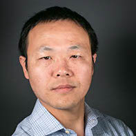
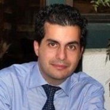
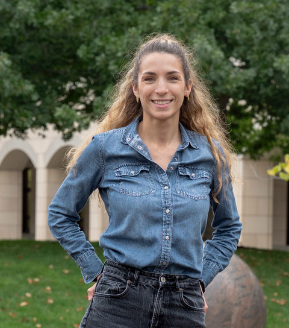
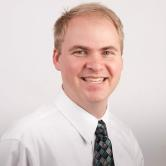
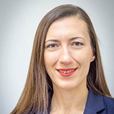
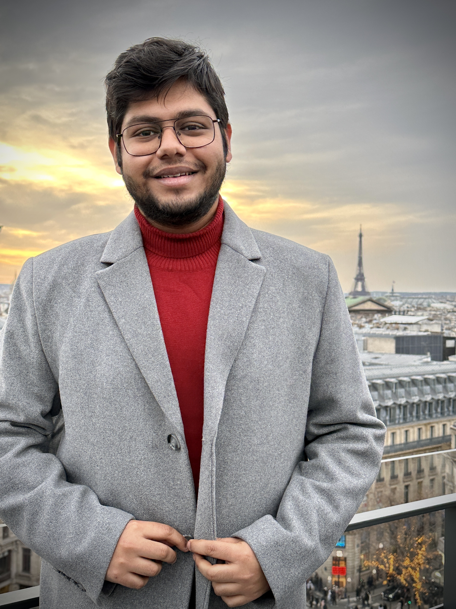
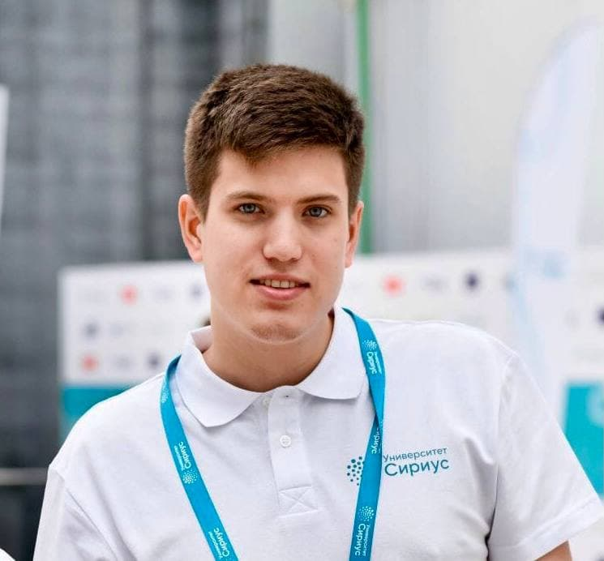

:wave: Welcome to the **3rd Workshop and Challenge on
Computer Vision In The Built Environment For The Design, Construction and Operation of Buildings** organized at :wave:  
{: .text-center} 

Building on the success of the previous two workshops, the 3rd Workshop on Computer Vision in the Built Environment continues on connecting the domains of Architecture, Engineering, and Construction (AEC) with that of Computer Vision by establishing a common ground of interaction and identify shared research interests. Specifically, this workshop focuses on the as-is semantic status of built environments and the changes that take place within them over time. These topics will be presented from the dual lens of Computer Vision and AEC-FM, highlighting the limitations and bottlenecks related to developing applications for this specific domain. The objective is for attendees to learn more about AEC-FM and the variety of real-world problems that, if solved, could have a tangible impact on this multi trillion dollar industry as well as the overall quality of life across the globe.

The workshop will begin by establishing ways to capture the as-is status of a space with expert speakers from both the AEC and Computer Vision domains. Attendees will be then introduced to the type of information required for the spatiotemporal analysis of our built environment in AEC, with a focus on effective management, safety, and the role of users in this process. Following that, the topic of scene understanding from 3D and 4D reconstructions will be presented. Finally, to close the loop from understanding real-world built environments to designing built environments better and faster, the topic of scene synthesis at a geometric and semantic level will be presented. The importance of closing the loop for the AEC industry is paramount, especially when considering the design paradox. Architects are designing living spaces without any feedback from their previous designs. Learning to design using data from spaces that are already occupied and in-use, can provide designers with insights on what makes spaces appropriate for supporting the quality of life of the users.

To further establish connections between the two domains and identify what we can do right now and what is still hard to solve, we will host the **3rd International Scan-to-BIM competition** targeted on acquiring the semantic as-is status of buildings given their 3D point clouds. Specifically, we will focus on the tasks of floorplan reconstruction and 3D building model reconstruction and present appropriate interdisciplinary metrics for solving them. The past two years we observed that a large gap remains before these problems can be considered solved and actually meet the needs of practitioners. We regard this workshop as the ideal environment for understanding the challenges and steps forward given that it provides convergence between the research and practical communities from multiple disciplines.

---

## :newspaper: **News** {#news}
- **12 Jun 2023 ---** :calendar: Workshop schedule released.
- **09 Jun 2023 ---** :trophy: Challenge winners have been announced! Thank you to all participants.
- **05 Jun 2023 ---** :loudspeaker: Challenge is now concluded.
- **10 Apr 2023 ---** :loudspeaker: Challenge dates have been announced!
- **05 Apr 2023 ---** :tada: Website is live!

---

## :hourglass_flowing_sand: **Important Dates** {#dates}
> **NOTE**: The submission/release times are **00:00:00 UTC** on the specified date.
 
- **12 Apr 2023 ---** Training + Validation + Testing data available for 2D 
- **14 Apr 2023 ---** Training + Testing data available for 3D
- **15 Apr 2023 ---** Evaluation server **open** to evaluate test submissions
- **~~02 Jun~~ 05 Jun 2023 (11:59:59 UTC) ---** Challenge Submission Deadline
- **07 Jun 2023 ---** Notification To Participants
- **18 Jun 2023 ---** CV4AEC Workshop @ CVPR 2023

---

## :calendar: **Schedule** {#schedule}

The workshop will take place on **18 June 2023** from **09:00 - 18:00 PDT** at **CVPR (Hall East 7)**.
> **NOTE**: Times are shown in **Pacific Daylight Time**. Please take this into account if joining the workshop virtually.

| Time (PDT)    | Duration | Event                                                                  |
|---------------|----------|------------------------------------------------------------------------|
| 09:00 - 09:30 | 30 mins  | Introduction to Workshop and Challenge                                 |
| 09:30 - 10:00 | 30 mins  | **Avideh Zakhor** -- Improving energy efficiency of buildings using drones and robots          |
| 10:00 - 10:30 | 30 mins  | **Pingbo Tang** -- Computer Vision and Multi-Source Data-Driven Simulations for Safe and Efficient Operations of Aging Civil Infrastructure   |
| 10:30 - 10:50 | 20 mins  | _Coffee Break_                                                         |
| 10:50 - 11:30 | 40 mins  | Winner Presentations, 2D Floorplan Reconstruction                      |
| 11:30 - 12:00 | 30 mins  | **Manmohan Chandraker** - Towards Photorealism in Indoor Digital Twins  |
| 12:00 - 12:30 | 30 mins  | **Mani Golparvar Fard** - Geometry-Informed 3D Reconstruction and Recognition:  Bi-Directional Relationship Between Computer Vision and Design/Construction in the Built Environment |
| 12:30 - 13:30 | 60 mins  | _Lunch Break_                                                          | 
| 13:30 - 14:15 | 45 mins  | Winner Presentations, 3D Building Model Reconstruction                 |
| 14:15 - 15:00 | 45 mins  | _Community Engagement_                                                 |
| 15:00 - 15:30 | 30 mins  | **Despoina Paschalidou** -- Learning to generate and manipulate 3D environments      |
| 15:30 - 16:00 | 30 mins  | **Fernanda Leite** -- Automated 3D Modeling and Visual Storytelling: Crossing Disciplinary Boundaries  |
| 16:00 - 16:30 | 30 mins  | _Coffee Break_                                                         |
| 16:30 - 17:30 | 60 mins  | _Panel Discussion_                                                     |
| 17:30 - 18:00 | 30 mins  | _Conclusion Remarks_                                                   |

---

## :microphone: **Keynote Speakers** {#speakers}

<figure>
    
    <b> <a href="https://www2.eecs.berkeley.edu/Faculty/Homepages/zakhor.html">Avideh Zakhor</a>
     Professor, EE  UC Berkeley</b>
</figure>

<figure>
    
    <b> <a href="https://www.cmu.edu/cee/people/faculty/tang.html">Pingbo Tang</a>
     Professor, CEE  CMU</b>
</figure>

<figure>
    
    <b> <a href="https://cseweb.ucsd.edu/~mkchandraker/">Manmohan Chandraker</a>
     Professor, CSE  UC San Diego</b>
</figure>

<figure>
    
    <b> <a href="https://cee.illinois.edu/directory/profile/mgolpar">Mani Golpavar Fard</a>
     Professor, CEE  UIUC</b>
</figure>

<figure>
    
    <b> <a href="https://paschalidoud.github.io/">Despoina Paschalidou</a>
     Postdoctoral Researcher, CS  Stanford</b>
</figure>

<figure>
    
    <b> <a href="https://paschalidoud.github.io/">Fernanda Leite</a>
     Professor, CAEE   UT Austin</b>
</figure>

[**Avideh Zakhor**](https://www2.eecs.berkeley.edu/Faculty/Homepages/zakhor.html)
is a Professor of electrical engineering and computer science at the University of California at Berkeley (Berkeley) where she holds the Qualcomm chair. Prof. Zakhor’s research is focused on 3D computer vision, reality capture for augmented and virtual reality, sensor fusion, and application of deep learning to signal, image and video processing. Dr. Zakhor is the recipient of multiple awards underscoring both her academic and professional qualifications including the winner of phase 1 and 2 of U.S. Department of Energy sponsored E-Robot project in 2021 and 2022. She is a fellow of IEEE and was chosen as the  SPIE Electronic Imaging Scientist of the Year  in 2018. Dr. Zakhor has spun off numerous startups from her lab at UC Berkeley. In 2005, she co-founded UrbanScan to commercialize software/hardware systems for rapid 3D, automated 3D modeling of cities, which became part of Google Earth product when UrbanScan was acquired by Google (Nasdaq;GOOG) in 2007. In 2015, she founded Indoor Reality  to develop 3D indoor mapping technologies for fast, automated, visual documentation, asset management, and energy audits of existing buildings. Indoor Reality was acquired by a large multi-billion dollar construction supplies company in 2019.

[**Pingbo Tang**](https://www.cmu.edu/cee/people/faculty/tang.html)
is an Associate Professor in the Department of Civil and Environmental Engineering. He founded and is directing Spatiotemporal Workflows and Resilient Management Laboratory (SWARM Lab). He obtained his Bachelor’s Degree in Civil Engineering in 2002, and his Master’s Degree in Bridge Engineering in 2005, both from Tongji University, Shanghai, China. He obtained his Ph.D. from the group of Advanced Infrastructure Systems (AIS) at Carnegie Mellon University in 2009. Tang is an expert on civil infrastructure operations and human systems engineering for civil infrastructure operational safety. His research explores remote sensing, human systems engineering, and information modeling technology in support of the spatiotemporal analyses needed for the effective management of workspaces, constructed facilities, and civil infrastructure systems. His ongoing studies have been examining sensing and modeling methods for comprehending the Human-Cyber-Physical-Systems (H-CPS) in accelerated construction and infrastructure operations (e.g., airport operations, power plant operations, water treatment plant control). He has published more than 100 peer-reviewed articles in these areas. The National Science Foundation (NSF), Department of Energy (DOE), The National Aeronautics and Space Administration (NASA), and the industry have funded his research efforts.

[**Manmohan Chandraker**](https://cseweb.ucsd.edu/~mkchandraker/)
is an Associate Professor at the CSE department of the University of California, San Diego. His research interests are in computer vision, machine learning and graphics-based vision, with applications to autonomous driving and augmented reality. His works have received the Marr Prize Honorable Mention for Best Paper at ICCV 2007, the 2009 CSE Dissertation Award for Best Thesis at UCSD, a PAMI special issue on best papers of CVPR 2011, the Best Paper Award at CVPR 2014, the 2018 NSF CAREER Award and the 2018 and 2019 Google Daydream Research Award. He serves as an Area Chair at CVPR, ICCV, ECCV, ICVGIP and AAAI.

[**Mani Golparvar Fard**]("https://cee.illinois.edu/directory/profile/mgolpar") is a Professor of Civil Engineering and Computer Science & Technology Entrepreneurship. He is a Faculty Entrepreneurial Fellow, Excellence Faculty Fellow, and the director of the Real-time and Automated Monitoring and Control (RAAMAC) lab at the University of Illinois at Urbana-Champaign (UIUC). He received his Ph.D. degree in Civil Engineering and MS degree in Computer Science from UIUC in 2010, MASc in Civil Engineering from the University of British Columbia in 2006, and MS and BS in Civil Engineering from Iran University of Science and Technology in 2005 and 2002 respectively. Prior to joining the faculty at UIUC, he was an Assistant Professor in Civil Engrg at Virginia Tech. Dr. Golparvar has worked with many national and international construction companies and most extensively with Turner Construction. Dr. Golparvar-Fard has several patents and is currently involved with Reconstruct Inc., an early-stage technology company with $28 million in venture capital funding that was founded based on the outcomes of his ongoing research projects.

[**Despoina Paschalidou**]("https://paschalidoud.github.io/") is a PostDoc at Stanford University working with Prof. Leo Guibas at the Geometric Computation Group. Prior to this, she did her PhD at the Max Planck Institute for Intelligent Systems in Tubingen and the Computer Vision Lab in ETH Zurich, under the guidance of Prof. Andreas Geiger and Prof. Luc van Gool. She received her Diploma in Electrical and Computer Engineering from the Aristotle University of Thessaloniki, in 2015. Her research interests revolve around editable and interpretable representations of 3D objects and scenes. She spent 1 year working with Prof. Sanja Fidler at NVIDIA Research on developing interactive tools for content creation. Moreover, she spent 6 months at FAIR working with Prof. Andrea Vedaldi and David Novotny on unsupervised 3D reconstruction from video data.

[**Fernanda Leite**](https://www.caee.utexas.edu/people/faculty/faculty-directory/leite) a Professor in the Cockrell School of Engineering at the University of Texas at Austin. She holds the John A. Focht Centennial Teaching Fellowship in Civil Engineering. She combines expertise in architectural engineering and computing in her modeling and built environment research. She is an Associate Editor for the journal Automation in Construction. Most of her work has been in building and infrastructure systems information modeling, visualization and collaboration technologies, and circular economy in the built environment. At UT-Austin, Dr. Leite teaches courses on Building Information Modeling, Project Management and Economics, Construction Safety, and Sustainable Systems Engineering.

---

## :trophy: **Challenge Winners** {#winners}

### 2D Floor Plan Reconstruction

| Team | Precision (5cm) | Precision (10cm) | Precision (20cm) | Recall(5cm) | Recall(10cm) | Recall (20cm) | IoU      | Warping Error | Betting Error |
| ---- | --------------- | ---------------- | ---------------- | ----------- | ------------ | ------------- | -------- | ------------- | ------------- |
| Tsinghua-CBIMS | 0.115 |	0.233	        | 0.366	           | 0.073	     |  0.132	    |   0.197       | 0.596    |    0.218	   |  1.132        |
| HKU-iLab       | 0.036 |	0.077	        | 0.13	           | 0.114	     |  0.242	    |   0.399       | 0.457    |    0.231	   |  1.229        |
| joanna         | 0.100 |	0.400	        | 0.700  	       | 0.001  	 |  0.002 	    |   0.004 	    | 0.000    |    0.710 	   |  1.650        |

### 3D Building Model Reconstruction

| Team | Average IoU	 |   Columns IoU	|  Doors IoU	   | Walls IoU	 | 5cm Average F1 |	10cm Average F1 | 20cm Average F1 |	10cm Columns F1 | 10cm Doors F1 | 10cm Walls F1 |
| ---- | --------------- | ---------------- | ---------------- | ----------- | -------------- | --------------- | --------------- | --------------- | ------------- | ------------- |
| HKU-iLab       | 0.431 |	0.478 	        |    0.473 	       |  0.362 	 |  0.470 	      |  0.561 	        |  0.638 	      |  0.618 	        |  0.588 	    |  0.502        |
| Tsinghua-CBIMS | 0.379 |	0.470 	        |    0.459    	   |  0.246 	 |  0.475 	      |  0.589 	        |  0.668 	      |  0.628 	        |  0.627 	    |  0.529        |
| HumanTech      | 0.188 |	0.315 	        |    0.099 	       |  0.204 	 |  0.260 	      |  0.350 	        |  0.422   	      |  0.638 	        |  0.205 	    |  0.331        |
| fkfm           | 0.130 |	0.146 	        |    0.088 	       |  0.164 	 |  0.132 	      |  0.224 	        |  0.351 	      |  0.219 	        |  0.176 	    |  0.275        |

### **Teams**
 * **Tsinghua-CBIMS**: Chen PENG, Ziyi KE, Zijian SUN, Yudong LIU, Xinyi DU, Chao DENG, Ge GAO, Ming GU; School of Software, Tsinghua University
 * **HKU-iLab**: Yijie Wu, Sou-Han Chen, Qianyun Zhou, Siyuan Meng, Dong Liang, Fan Xue; The University of Hong Kong
 * **HumanTech**: Mahdi Chamseddine, Fabian Kaufmann, Jason Rambach; DFKI and RPTU in Kaiserslautern, Germany

---
## :checkered_flag: **Challenge** {#challenge}
The workshop will host the 3rd International Scan-to-BIM challenge. The challenge will include the following tasks:

I. 2D Floorplan Reconstruction \
II. 3D Building Model Reconstruction

### 2D Floor Plan Reconstruction

The 2D Floorplan Reconstruction challenge contains a total of 31 buildings with multiple floors each and dozens of rooms on each floor. Of which, 20 buildings are designated as the training set, with a total of 49 point clouds. The validation and testing sets contain 5.5 buildings with 21 point clouds each. For each model, there is an aligned point cloud in LAZ format. For the training and validation sets, a corresponding floorplan aligned with the coordinate system of the point cloud is also provided. The 2D challenge is hosted on **[Codalab](https://codalab.lisn.upsaclay.fr/competitions/12386)**. We have provided a **[Github repository](https://github.com/cv4aec/2d-floorplan-eval)** containing the evaluation code and metrics for floorplan reconstruction. The submission should be made in the same JSON format as in the provided ground truth. We include metrics to evaluate the reconstruction of the walls, doors, and columns, as well as floor area in 2D : 

1. **Geometric Metrics** \
    a. _IoU_ of each room (a room is defined as a completely separated area with walls and doors). \
    b. _Accuracy of endpoints_ : Precision/Recall at 3 different thresholds: 5cm, 10cm and 20cm, as well as the F-measure at each threshold will be evaluated in the coordinate system of the point cloud. The provided endpoints will be matched with the Hungarian algorithm to the point cloud, and every point that is within a certain threshold will be determined as a match. \
    c. _Orientation_ For each matched line between the ground truth, we will compute the cosine similarity metric between them as the normalized dot product. If a line is not matched with ground truth, the cosine metric will be zero. Finally, the metric will be averaged over all the ground truth lines.

2. **Topological Metrics** \
    a. _[Warping error](https://ieeexplore.ieee.org/document/5539950)_ : The warping error will first warp the predicted floorplan to the ground truth with a homotopic deformation, and then compute the pixels that cannot match after the deformation. \
    b. **_Betti number error_** : The Betti number error will compare the Betti numbers between the prediction and the ground truth and output the absolute value of the difference.

### 3D Building Model Reconstruction

The training data consists of 18 floors from 10 buildings. For each model, there is an aligned point cloud in LAZ format. The 3D building coordinates for walls, columns and doors are presented in 3 separate JSON files. We focus on the reconstruction of walls, columns, and doors. The 3D challenge is hosted on **[Codalab](https://codalab.lisn.upsaclay.fr/competitions/12405)**. We have provided a **[Github repository](https://github.com/cv4aec/3d-matching-eval)** containing the evaluation code and metrics for building model reconstruction. The submission should be made in the same JSON format as in the provided ground truth. We evaluate the submissions on a variety of metrics : 

1. **3D IoU** of the 3D bounding box of each wall
2. **Accuracy of the endpoints** : Precision/Recall at 3 different thresholds: 5cm, 10cm and 20cm, as well as F-measure will be evaluated in the coordinate system of the point cloud. The provided endpoints will be matched with the Hungarian algorithm to the point cloud, and every point that is within a certain threshold will be determined as a match. We evaluate per each of the three semantic types (i.e., wall, column, door).

> We would like to note that ALL the submissions **need to be constructed automatically**. Manual reconstructions are against the spirit of this challenge and will not be allowed.

## :question: **Questions** {#questions}
Contact the organisers at **[cv4aec.3d@gmail.com](mailto:cv4aec.3d@gmail.com)**

---
# **Organizers** {#organizers}
## :construction_worker: **Senior Organizers** {#senior-organizers}

<figure>
    
    <b> <a href="https://ir0.github.io/">Iro Armeni</a>
     Postdoctoral Researcher, CS & CEE    ETHZ</b>
</figure>

<figure>
    
    <b> <a href="https://www.linkedin.com/in/erzhuo-ezra-che-40888137/">Erzhuo Che</a>
     Assistant Professor (Senior Research), CEE   Oregon State</b>
</figure>

<figure>
    
    <b> <a href="https://web.stanford.edu/~fischer/">Martin Fischer</a>
     Professor, CEE   Stanford</b>
</figure>

<figure>
    
    <b> <a href="https://www.cs.sfu.ca/~furukawa/">Yasutaka Furukawa</a>
     Associate Professor, CS   Simon Fraser</b>
</figure>

<figure>
    
    <b> <a href="https://fcl.ethz.ch/people/Module-Lead/daniel-hall.html#:~:text=Dr%20Daniel%20Hall%20is%20co,Geomatic%20Engineering%20at%20ETH%20Z%C3%BCrich.">Daniel Hall</a>
     Assistant Professor, CEE   ETHZ</b>
</figure>

<figure>
    
    <b> <a href="https://research.engr.oregonstate.edu/geomatics/faculty-members">Jaehoon Jung</a>
     Assistant Professor (Senior Research), CEE   Oregon State</b>
</figure>

<figure>
    
    <b> <a href="http://web.engr.oregonstate.edu/~lif/">Fuxin Li</a>
     Associate Professor, CS   Oregon State</b>
</figure>

<figure>
    
    <b> <a href="https://directory.forestry.oregonstate.edu/people/olsen-michael">Michael Olsen</a>
     Associate Professor, CEE   Oregon State</b>
</figure>

<figure>
    
    <b> <a href="https://people.inf.ethz.ch/pomarc/">Marc Pollefeys</a>
     Professor, CS   ETHZ</b>
</figure>

<figure>
    
    <b> <a href="https://cce.oregonstate.edu/turkan">Yelda Turkan</a>
     Assistant Professor, CEE   Oregon State</b>
</figure>

## :grimacing: **Student Organizers** {#student-organizers}

<figure>
    
    <b> <a href="https://sayands.github.io/">Sayan Deb Sarkar</a>
     MSc CS   ETHZ</b>
</figure>

<figure>
    
    <b> <a href="https://antonskoltech.github.io/">Anton Egorov</a>
     Research Assistant   Oregon State </b>
</figure>

