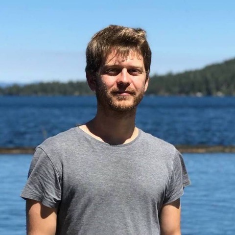
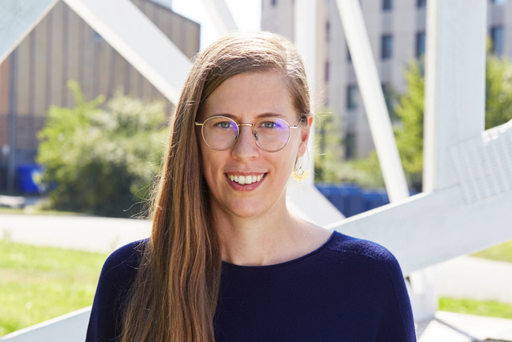
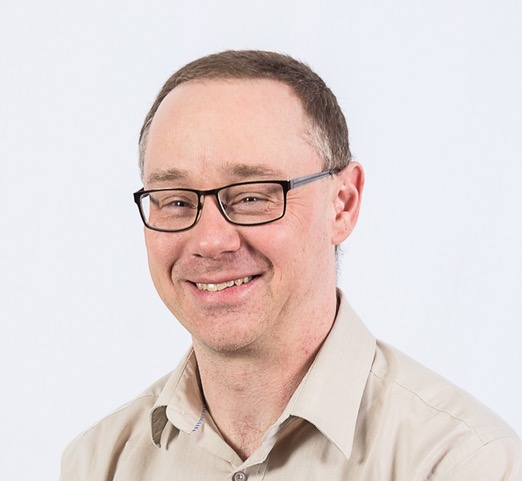
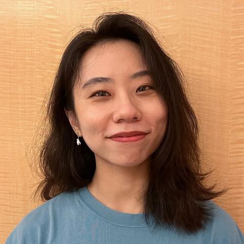

:wave: Welcome to the **4th Workshop and Challenge on
Computer Vision In The Built Environment For The Design, Construction and Operation of Buildings** organized at :wave:  
{: .text-center} 

Building on the success of the previous three workshops, the 4th Workshop on Computer Vision in the Built Environment continues on connecting the domains of Architecture, Engineering, and Construction (AEC) with that of Computer Vision by establishing a common ground of interaction and identify shared research interests. Specifically, this workshop focuses on the as-is semantic status of built environments and the changes that take place within them over time. These topics will be presented from the dual lens of Computer Vision and AEC-FM, highlighting the limitations and bottlenecks related to developing applications for this specific domain. The objective is for attendees to learn more about AEC-FM and the variety of real-world problems that, if solved, could have a tangible impact on this multi trillion dollar industry as well as the overall quality of life across the globe.

The workshop will begin by establishing ways to capture the as-is status of a space with expert speakers from both the AEC and Computer Vision domains. Attendees will be then introduced to the type of information required for the spatiotemporal analysis of our built environment in AEC, with a focus on effective management, safety, and the role of users in this process. Following that, the topic of scene understanding from 3D and 4D reconstructions will be presented. Finally, to close the loop from understanding real-world built environments to designing built environments better and faster, the topic of scene synthesis at a geometric and semantic level will be presented. The importance of closing the loop for the AEC industry is paramount, especially when considering the design paradox. Architects are designing living spaces without any feedback from their previous designs. Learning to design using data from spaces that are already occupied and in-use, can provide designers with insights on what makes spaces appropriate for supporting the quality of life of the users.

To further establish connections between the two domains and identify what we can do right now and what is still hard to solve, we will host the **4th International Scan-to-BIM competition** targeted on acquiring the semantic as-is status of buildings given their 3D point clouds. Specifically, we will focus on the tasks of floorplan reconstruction and 3D building model reconstruction and present appropriate interdisciplinary metrics for solving them. The past two years we observed that a large gap remains before these problems can be considered solved and actually meet the needs of practitioners. We regard this workshop as the ideal environment for understanding the challenges and steps forward given that it provides convergence between the research and practical communities from multiple disciplines.

---

## :newspaper: **News** {#news}
- **26 Jan 2024 ---** :loudspeaker: **Catherine De Wolf** and **Francis Engelmann** confirmed as keynote speaker.
- **26 Jan 2024 ---** :loudspeaker: **Derek Lichti** and **Yuanbo (Amber) Xiangli** confirmed as keynote speaker.
- **26 Jan 2024 ---** :tada: Website is live!

---

## :hourglass_flowing_sand: **Important Dates** {#dates}
> TBA!

---

## :calendar: **Schedule** {#schedule}
> TBA!

---

## :microphone: **Keynote Speakers** {#speakers}

<figure>
    
    <b> <a href="https://francisengelmann.github.io/">Francis Engelmann</a>
     PostDoc, CS  ETH Zurich</b>
</figure>

<figure>
    
    <b> <a href="https://www.catherinedewolf.com/">Catherine De Wolf</a>
     Professor, Civil  ETH Zurich</b>
</figure>

<figure>
    
    <b> <a href="https://www.geo-week.com/advisor/derek-lichti/">Derek Lichti</a>
     Professor, Geomatics  University of Calgary</b>
</figure>

<figure>
    
    <b> <a href="https://kam1107.github.io/">Yuanbo (Amber) Xiangli</a>
     Postdoc, CS  Cornell</b>
</figure>

[**Francis Engelman**](https://francisengelmann.github.io/)
is a PostDoc with Prof. Marc Pollefeys at ETH Zurich, and a visiting researcher at Google with Federico Tombari. His research interest lie at the intersection of computer vision and deep learning towards open-vocabulary 3D scene understanding with foundation models.
Francis is a Fellow of the ETH AI Center, the ELLIS Society, and the recipient of the ETHZ Career Seed Award. 

[**Catherine De Wolf**](https://www.catherinedewolf.com/)
is assistant professor and director of the Chair of Circular Engineering for Architecture (CEA) at ETH Zurich. Her work explores digital innovations such as reality capture and AI to advance the built environment towards a circular economy. She has a dual background in civil engineering and architecture and  completed her PhD at MIT. She is on the steering committee of the Centre for Augmented Computational Design in Architecture, Engineering and Construction (Design++). Catherine is also a faculty at the AI Center, EMPA, the Future Cities Lab, and the National Centre of Competence in Research on Digital Fabrication (DFAB). Additionally, Catherine provides regular consultation on environmental impact assessments for both government entities like the European Commission and engineering design offices such as Arup. Throughout her career, she has gained international experience working at institutions like the University of Cambridge, TU Delft, EPFL, Nanjing University, Kuwait University, and the African Urban Metabolism Network. Her contributions to these projects were often made possible by securing multiple fellowships, including the Swiss Excellence, WBI World Excellence, and Marie Sklodowska-Curie Postdoctoral Fellowships. 

[**Yuanbo Xiangli**](https://kam1107.github.io/)
is a postdoc scholar at Cornell University, working with Prof. Noah Snavely. Prior to this, she did her Ph.D at Multimedia Lab, the Chinese University of Hong Kong, supervised by Prof. Dahua Lin. She received her Master degree from University of Oxford and Diploma from the University of Nottingham in Computer Science. Her research interests lie in 3D computer vision and generative modelling. She has been working on photorealistic and efficient large-scale 3D indoor/outdoor scenes rendering, manipulation and generation, leveraging diverse 2D/3D data sources, geographic and architectural information. 

[**Derek Lichti**]("https://www.geo-week.com/advisor/derek-lichti/") 
is a Professor of Civil Engineering and Computer Science & Technology. Derek Lichti received his Bachelor’s degree in Survey Engineering from Toronto Metropolitan University in 1993 and MSc and PhD degrees in Geomatics Engineering from the University of Calgary in 1996 and 1999, respectively. He is currently Professor in the Department of Geomatics Engineering at the University of Calgary, which he joined in 2008 and served (2013-2018) as Department Head. He is currently ISPRS Congress Director and served (2013-2020) as Editor-in-Chief of the ISPRS Journal of Photogrammetry and Remote Sensing. His research program focuses on imaging metrology: precision 3D reality capture from imaging sensors, principally terrestrial laser scanners and digital cameras. It touches a wide range of applications including the documentation of at-risk cultural heritage sites, as-built modelling of industrial sites, wear and damage assessment in structures and industrial machinery, and dimensional control.

---

## :trophy: **Challenge Winners** {#winners}
> TBA!

---
## :checkered_flag: **Challenge** {#challenge}
> TBA!

## :question: **Questions** {#questions}
Contact the organisers at **[cv4aec.3d@gmail.com](mailto:cv4aec.3d@gmail.com)**

---
# **Organizers** {#organizers}
## :construction_worker: **Senior Organizers** {#senior-organizers}

<figure>
    
    <b> <a href="https://ir0.github.io/">Iro Armeni</a>
     Professor, CEE    Stanford</b>
</figure>

<figure>
    
    <b> <a href="https://www.linkedin.com/in/erzhuo-ezra-che-40888137/">Erzhuo Che</a>
     Assistant Professor (Senior Research), CEE   Oregon State</b>
</figure>

<figure>
    
    <b> <a href="https://web.stanford.edu/~fischer/">Martin Fischer</a>
     Professor, CEE   Stanford</b>
</figure>

<figure>
    
    <b> <a href="https://fcl.ethz.ch/people/Module-Lead/daniel-hall.html#:~:text=Dr%20Daniel%20Hall%20is%20co,Geomatic%20Engineering%20at%20ETH%20Z%C3%BCrich.">Daniel Hall</a>
     Assistant Professor, CEE   ETHZ</b>
</figure>

<figure>
    
    <b> <a href="https://research.engr.oregonstate.edu/geomatics/faculty-members">Jaehoon Jung</a>
     Assistant Professor (Senior Research), CEE   Oregon State</b>
</figure>

<figure>
    
    <b> <a href="http://web.engr.oregonstate.edu/~lif/">Fuxin Li</a>
     Associate Professor, CS   Oregon State</b>
</figure>

<figure>
    
    <b> <a href="https://directory.forestry.oregonstate.edu/people/olsen-michael">Michael Olsen</a>
     Associate Professor, CEE   Oregon State</b>
</figure>

<figure>
    
    <b> <a href="https://people.inf.ethz.ch/pomarc/">Marc Pollefeys</a>
     Professor, CS   ETHZ</b>
</figure>

<figure>
    
    <b> <a href="https://cce.oregonstate.edu/turkan">Yelda Turkan</a>
     Assistant Professor, CEE   Oregon State</b>
</figure>

## :grimacing: **Student Organizers** {#student-organizers}

<figure>
    
    <b> <a href="https://sayandebsarkar.com/">Sayan Deb Sarkar</a>
     MSc CS   ETHZ</b>
</figure>

<figure>
    
    <b> <a href="https://antonskoltech.github.io/">Anton Egorov</a>
     Research Assistant   Oregon State </b>
</figure>

